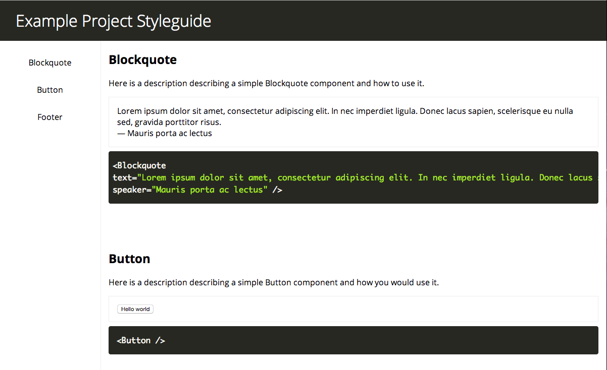

react-styleguide
----------------
A React component that takes in other components and organizes them into an easy to use styleguide.

Installation
------------
```
$ npm install --save react-styleguide
```

To view a working demo version,

```
$ npm install
$ npm run build
```

And then open the `demo/index.html` file in your browser.

Example Usage
-------------
Include the generated css file from `dist` if you want to use the styling that I've created in your project.

Just create a new component containing the Styleguide component.  Include all the components that you want in the styleguide and provide the information that you want in include in the props.  The props that can be included for each are:

- title
- description
- example (this is the code that will be displayed)

Inside the `div`, include the code that should be rendered and displayed in the styleguide.  This will probably be the same as the `example` prop.


```
var React = require('react');
var Styleguide = require('react-styleguide');

// Require the components that you want to include
import Button from './examples/Button.js'; 
import Blockquote from './examples/Blockquote.js'; 

var Component = React.createClass({
  render: function() {
    <Styleguide title="Example Project Styleguide">
      <div 
        title="Blockquote" 
        description="Here is a description describing a simple Blockquote component and how to use it." 
        example='<Blockquote 
text="Lorem ipsum dolor sit amet, consectetur adipiscing elit. In nec imperdiet ligula." 
speaker="Mauris porta ac lectus" />'
      >
        <Blockquote text="Lorem ipsum dolor sit amet, consectetur adipiscing elit. In nec imperdiet ligula." speaker="Mauris porta ac lectus" />
      </div>

      <div 
        title="Button" 
        description="Here is a description describing a simple Button component and how you would use it." 
        example="<Button />"
      >
        <Button />
      </div>

      ...
      
    </Styleguide>
  }
});
```

Styleguide Options
------------------
For the styleguide, the following options are available:

- `codeClassName` - changes the `<code>` class if you do not want to use Prism.js for highlighting otherwise defaults to `language-javascript`
- `highlight` - a function that can be passed if you want highlight the code using a different function from Prism.js's function. Defaults to just the code example itself.

Optional Includes
-----------------
You can have the styleguide come styling free if you desire, but it is also possible to have the included styles be used (they can be seen in the screenshots).  Please look at the `demo/index.html` to see what else could be included.

- Google web fonts
- `main.css` located in the `dist` folder
- `prism.js` located in the `demo` folder

Any and all of these are optional but are recommended.

Extending the Styles
--------------------
The styles of the styleguide follow a simple version of [SuitCSS](https://suitcss.github.io/), and follow a simple hierarchy.  Please view the `scss/main.scss` for a look at how to style the page.

Screenshots
-----------


TODO
----
- Better way of converting from example and example code to the styleguide (instead of including it twice, essentially)
- Write tests for the component (framework is already set in place)
- Make styled version responsive

License
-------
MIT
